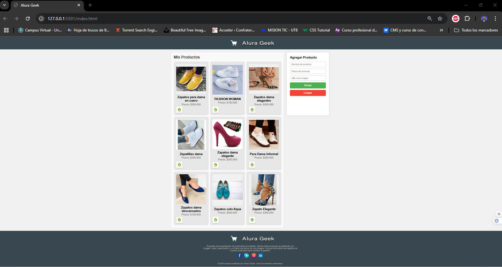

# Nombre del Proyecto

## Descripción del Proyecto
Este proyecto es **ALURA GEEK**, una aplicación web de gestión de productos que permite a los usuarios agregar, visualizar y eliminar productos de una lista. Cada producto incluye información clave como nombre, precio e imagen. Además, la aplicación almacena los productos en el localStorage, lo que permite que los datos se mantengan en el navegador incluso después de actualizar la página.
## Funcionalidades
- **Agregar productos**: Los usuarios pueden añadir productos con un nombre, precio e imagen.
- **Visualización de productos**: Los productos se muestran en una lista donde los usuarios pueden ver sus detalles.
- **Eliminación de productos**: Cada producto tiene un botón para eliminarlo de la lista y del almacenamiento.
- **Persistencia de datos**: Los productos se almacenan en localStorage para conservar la lista al recargar la página.

## Cómo usar el proyecto
1. Al cargar la página, cualquier producto previamente agregado aparecerá automáticamente.
2. Para añadir un nuevo producto, completa el formulario con los datos requeridos (nombre, precio, URL de imagen) y envíalo.
3. Los productos se mostrarán en la lista con sus detalles y un botón de eliminación.
4. Para eliminar un producto, haz clic en el botón de eliminación junto al producto deseado.

## Imágen del Proyecto

## Ayuda y Documentación
Los usuarios pueden obtener ayuda sobre este proyecto contactando conmigo o revisando el código fuente para entender las funcionalidades. Asegúrate de revisar el archivo api.js y scripts.js para entender cómo funciona la conexión con la API y la manipulación de localStorage.
## Proyecto funcionando, productos agregados

## Autores
Este proyecto fue desarrollado por **Faiver Augusto Clavijo Medina** como un ejercicio práctico de Front End: Challenge AluraGeek, para implementar CRUD (Crear, Leer, Actualizar, Eliminar) en una aplicación de front-end usando localStorage y JavaScript.
